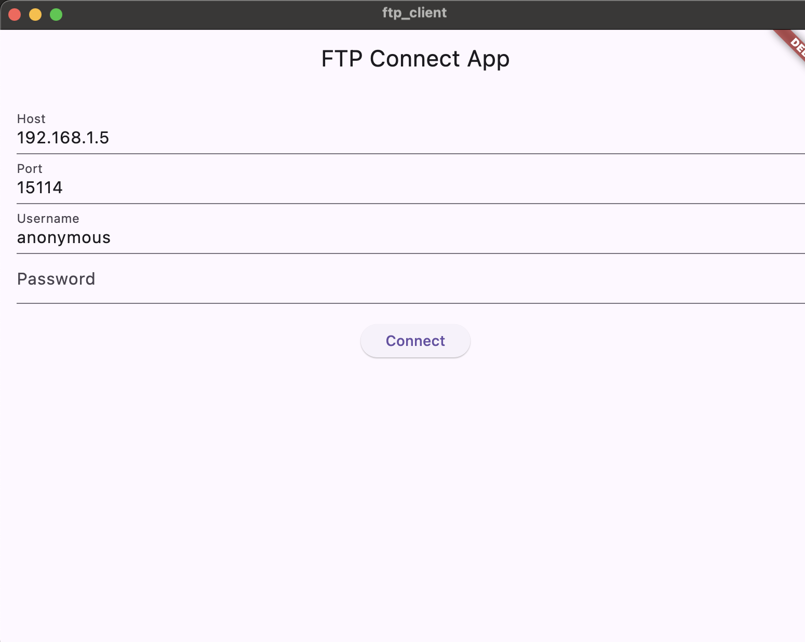

# Flutter FTP Client

Flutter FTP Client is a simple and intuitive application that allows users to connect to an FTP server, browse directories, and download files. This app demonstrates the use of FTP in a Flutter application and provides a user-friendly interface for file transfers.

## Features

- **Connect to FTP Server**: Easily connect to an FTP server by providing the host, port, username, and password.
- **Browse Directories**: Navigate through directories on the FTP server.
- **Download Files**: Download files from the FTP server to your local device.
- **Progress Tracking**: Track the progress of file downloads.
- **Snackbar Notifications**: Get notifications about the status of your downloads.

## Screenshots



## Getting Started

### Prerequisites

- Flutter installed on your development machine. You can follow the instructions [here](https://flutter.dev/docs/get-started/install) to install Flutter.
- An FTP server to connect to.

### Installation

1. Clone the repository:
   ```sh
   git clone https://github.com/abdelaziz-mahdy/ftp-client.git
   cd ftp-client
   ```

2. Install dependencies:
   ```sh
   flutter pub get
   ```

3. Run the app:
   ```sh
   flutter run
   ```

## Usage

### Connecting to an FTP Server

1. Launch the app.
2. Fill in the connection details:
   - **Host**: The IP address or hostname of the FTP server.
   - **Port**: The port number (default is 21).
   - **Username**: Your FTP username (default is 'anonymous').
   - **Password**: Your FTP password (leave blank if using anonymous login).
3. Tap the **Connect** button.

### Browsing Directories

- Once connected, the app will display the contents of the current directory.
- Tap on a folder to navigate into it.
- Tap on the `..` folder to navigate to the parent directory.

### Downloading Files

- Tap on a file to initiate the download.
- Confirm the download in the dialog that appears.
- Track the progress of your download in real-time.
- Once the download is complete, a snackbar notification will appear.

## Code Overview


### FTP Client Manager

`ftp_client_manager.dart`:
Handles connection to the FTP server and directory listing.

### Download Manager

`download_manager.dart`:
Manages file download queue and progress tracking.

### FTP Home Page

`ftp_home_page.dart`:
Main UI of the app that switches between connection form and directory listing.

### FTP Connect Form

`ftp_connect_form.dart`:
Form to input FTP server details and connect.

### Directory List

`directory_list.dart`:
Displays the list of directories and files.

### File Tile

`file_tile.dart`:
Represents a file or directory item in the list with options to download or navigate.

## Contributions

Contributions are welcome! Please fork the repository and submit a pull request with your changes. Make sure to follow the existing code style and include tests for new features.


## License

This project is licensed under the MIT License. See the [LICENSE](LICENSE) file for details.


